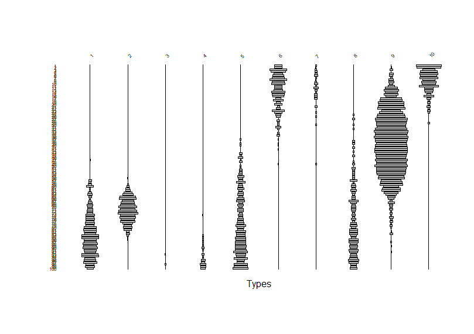
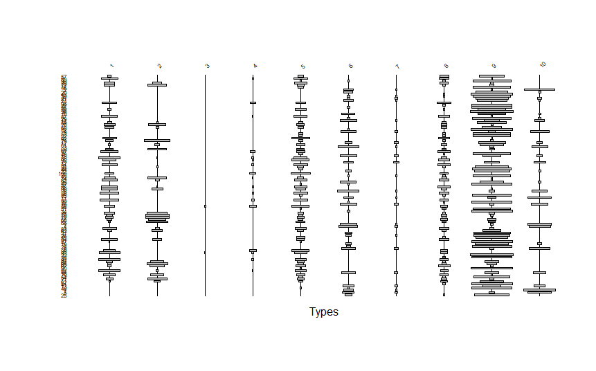

# MCDs and the Model Behind Them
## What is an MCD?
1. A weighted averaged of dates. The dates are estimates of the midpoints of the span of time over which each ceramic type found in an assmblage was manufactured. The weights are frequencies of each type in the assemblage -- more popular types get more weight.  
2. The ingredients:
    - A set of midpoints for the types *m<sub>i</sub>*. For example, for three types,*m<sub>i</sub>* = [1770, 1800, 1820]. Here the subscript *i* tells us which type we are dealing with: *m<sub>1</sub>* = 1770, *m<sub>2</sub>* = 1800, *m<sub>3</sub>* = 1820.     
    - A set of counts for the types  *x<sub>i</sub>*. For example, for the same three types,  *x<sub>i</sub>* = [21, 17, 36].
3. The algorithm:
    - Multiply the type midpoints by their corresponding counts.
    - Add up the products to get a "sum of products".
    - Divide the sum of products by the sum of the counts.
4. Here it is in R: 
``` 
m <- c(1770, 1800, 1820)
x <- c(21, 17, 36) 
mcd <- sum(m*x)/sum(x)
``` 
5. Try it!
    - ```x``` an ```m``` are *numeric vectors*. 
    - R is happy to multiply them together, producing a vector that has the products of the correspoding elements of ```m``` an ```x```.
    - ```sum(m*x)```sums the products and ```sum(x)``` sums the counts.
6. The formula:


## Why would this work?
1.  There is a model behind the MCD method: our old friend the frequency-seriation model.
    - The model is simple empirical generization: When we measure the "popularity" of a series of historical types over time, the trajectories of change will form lenticular, unimodal (battleship-shaped) curves. Something like this:

    - In this plot, each column of grey bars represents a ceramic type. The bar width scale with type frequency in a given time period. The y (vertical) axis is time and spans 100 time periods (e.g. years).
    - I generated these data in R -- the type frequencies follow Gaussian curves as a function of time.   
2. As archaeologists we never get to see this. Instead, we might see someting like this:
   


### [On to Part II: MCDs at San Marcos Pueblo (and writing your own functions),..](https://github.com/DAACS-Research-Consortium/DAACS-Open-Academy/blob/main/FSS2021/Workshop5/Part_II.md)

   
   
