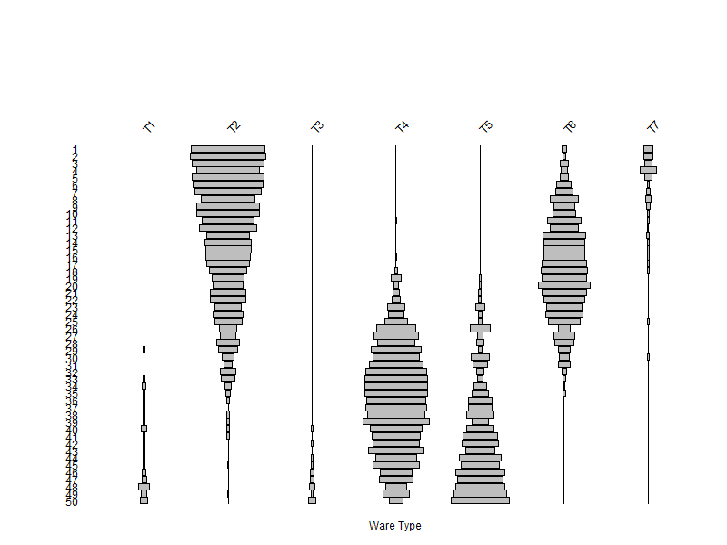

# MCDs and the Model Behind Them
## MCDs and How to Compute them in R
1. A weighted averaged of dates. The dates are estimates of the midpoints of the span of time over which each ceramic type found in an assemblage was manufactured. The weights are frequencies of each type in the assemblage -- more popular types get more weight.  
2. The ingredients:
    - A set of midpoints for the types *m<sub>i</sub>*. For example, for three types,*m<sub>i</sub>* = [1770, 1800, 1820]. Here the subscript *i* tells us which type we are dealing with: *m<sub>1</sub>* = 1770, *m<sub>2</sub>* = 1800, *m<sub>3</sub>* = 1820.     
    - A set of counts for the types  *x<sub>i</sub>*. For example, for the same three types,  *x<sub>i</sub>* = [21, 17, 36]. As before, the subscript *i* tells us which type we are dealing with: *x<sub>1</sub>* = 21, *x<sub>2</sub>* = 17, *x<sub>3</sub>* = 36.     
3. The algorithm:
    - Multiply the type midpoints by their corresponding counts.
    - Add up the products to get a "sum of products".
    - Divide the sum of products by the sum of the counts.
4. Here it is in R: 
``` 
wareMidpoints <- c(1770, 1800, 1820)
wareCounts1<- c(21, 17, 36) 
mcd <- sum(wareMidpoints*wareCounts1)/sum(wareCounts1)
``` 
5. Try it!
    - ```wareMidpoints``` and ```wareCounts1``` are *numeric vectors*. 
    - R is happy to multiply them together, producing a vector that has the products of the corresponding elements of ```wareMidpoints``` and ```wareCounts1```.
    - ```sum(wareMidpoints*wareCounts1)```sums the products and ```sum(wareCounts1)``` sums the counts.
  
6. Can you compute an MCD for these counts for the same 3 ware types?
```
wareCounts2 <- c(132, 80, 0) 
```
7. We often have MANY assemblages. How can we estimate MCDs for them in one go?
    - The secret sauce is to use *matrices*.
    - In R a *matrix* is one or more vectors glued toether, with a fixed number of rows and columns. 
    - The vectors must me all the same type. In other words a matrix MUST contain all numbers, all characters, or all logical values (T/F).
    - Here's how we would create matrix for our two assemblages:
 ```
 wareCountsMat <- rbind(wareCounts1,wareCounts2)
 ```
 
 Try it! And then try these commands:
     
 ```
wareCountsMat
rownames(wareCountsMat)
colnames(wareCountsMat)
colnames(wareCountsMat) <- c('T1', 'T2', 'T3')
wareCountsMat
```
How cool is that? 
We have a number matrix with row and column names to help us keep track.
On to the answer to our question. Here is the code:
```
( wareCountsMat %*% wareMidPoints) / rowSums( wareCountsMat)
```
   - ```%*%``` is R's operator for matrix multplication. It says: 
       - Take the first row on the matrix on the left, and multiply it by the first column of the matrix on the right. Add up the products and stick the sum in the first row and first column of a new matrix.
       - Take the second row of the matrix on the left, and multiply it by the first column of the matrix on the right. Add up the products and stick them in the second row and first column of a new matrix. 
       - Etc...
       - The resulting matrix will have as many rows an the matrix on the left and as many columns as the matrix on the left.
       - For the multiplication to work, the two arguments must be "conformable"): number of columns on the he left nust equal the number of rows on the right.
 
    
## Why would MCDs work?
1.  There is a model behind the MCD method: our old friend the frequency-seriation model.
    - The model is simple empirical generization: when we measure the "popularity" of a series of historical types over time, the trajectories of change will form lenticular, unimodal (battleship-shaped) curves. Something like this:

    - In this *battleship plot*, each column of grey bars represents a ceramic type. The bar widths scale with type frequency in a given time period (e.g. 1 year). The y (vertical) axis is time and spans 50 time periods (e.g. years).
    - We generated these data in R -- the type frequencies follow Gaussian curves as a function of time.   
2. As archaeologists we never get to see this. Instead, we might see something like this:
   
    - This battleship plot is the result of randomly ordering the rows (assemblages) of the first plot. It represents the fallen state in which we often find ourselves when faced with archaeological data: ignorance.
    - The question is...if we just have the the assemblage data, how can we get estimate the temporal order?
3. Let's try MCDs!
    - Because this is a simulation, we know the midpoints for each of the 10 types. Here they are strait from R:
``` 83.43  72.46 131.04 137.17  87.67  -4.12 -18.50  85.70  42.60  -8.05 ```
    - We can use the midpoints and the type frequencies from the simulation to compute *estimated MCDs* for the 100 assemblages.
    - What's the MCD recipe again?

4. Then we compare the estimated MCDs with the *true* dates. And we know they are the true dates because we made them up! Here is the scatter plot:


5. In the real world. we can't check our results by making a plot like the one above. But we can use the *estimated MCDs* to sort the rows (assemblages) of the data matrix that contain the type frequencies. We then make a battleship plot of the the assemblages in MCD order and see if the Gaussian response curves, which are assumed by the MCD model.  
    - If we see the curves, what can we conclude? 
    - What if we don't see the curves?
  


## A Little MCD History
1. MCDs were introduced by Stanley South (1971) "Evolution and Horizon as Revealed in Ceramic Analysis in Historical Archeology". Here is the ms.: 
https://scholarcommons.sc.edu/cgi/viewcontent.cgi?article=1014&context=archanth_books
2. South saw the link to the frequency-seriation model. But he did not see that making a battleship plot, based on the order of the assemblages,was a great way to check if the assemblage data in particular applications met the assumptions of the model.
3. South (1971) was anticipated by a much more sophistcated application of the same idea in ecology by R.H. Whitaker (1956) "Vegetation of the Great Smoky Mountains," *Ecological Monographs*, Vol. 26, 1-80. In ecology this approach is called "direct gradient analysis". 
https://www.fcnym.unlp.edu.ar/catedras/ecocomunidades/Whittaker%20-%20Vegetation%20of%20the%20Great%20Smoky%20Mountains.pdf
    - Here's a plot of Whitaker's Smoky Mountain monograph:

    - Here the underlying gradient is moisture. Whitaker also looked at elevation.
    - Whitaker's work with non-temporal gradients is a healthy reminder for us that "time is not the only gradient" that might produce Gaussian response curves. For ceramic types, can you think of others? How might we address this ambiguity?
     

### [On to Part II: TPQs,..](https://github.com/DAACS-Research-Consortium/DAACS-Open-Academy/blob/main/FSS2021/Workshop5/Part_II.md)

   
   
