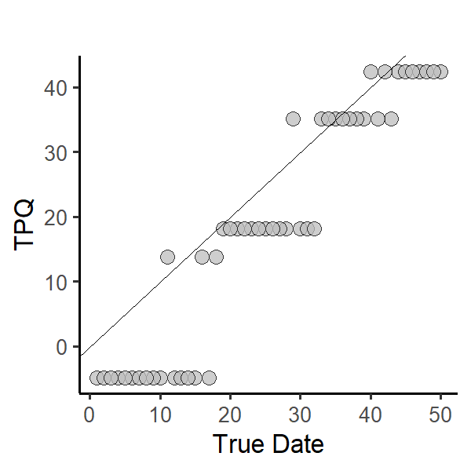
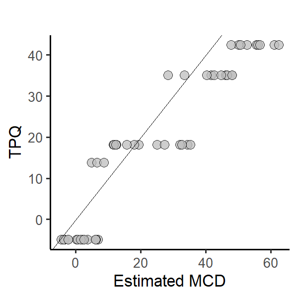

# TPQs 
1.  *Terminus post quem* is Latin for "boundary after which". In archaeology the boundary is a temporal one: a date, the date after which some event occurred. In the case of a ceramic assemblage, the event is the date when the last sherd was added or (roughly) the date of deposition. 
2. The ceramic TPQ for an assemblage is just the *latest* beginning manufacturing date among the beginning manufacturing dates for all the ware types found in the assemblage. Here are the beginning manufacturing dates of 4 ware types found in an assemblage. What's the TPQ?
    - North Devon Slipware - 1600
    - Slipware, North Midlands/Staffordshire - 1670
    - Slip Dip - 1715
    - Staffordshire Brown Stoneware - 1700 
4. Questions: 
     - If TPQs date deposition events, what is the "event" that MCDs date?
     - How would you expect MCDs to be related to TPQs for a given set of assemblages?
 4. Here's a scatter plot of TPQs as a function of true dates for the same simulation we used to illustrate MCDs:
  
     - Uneven stair steps and the stair treads have holes. What's up with that?
 5. And here are the TPQs as a function of the estimated MCDs:
   

   
   

  
