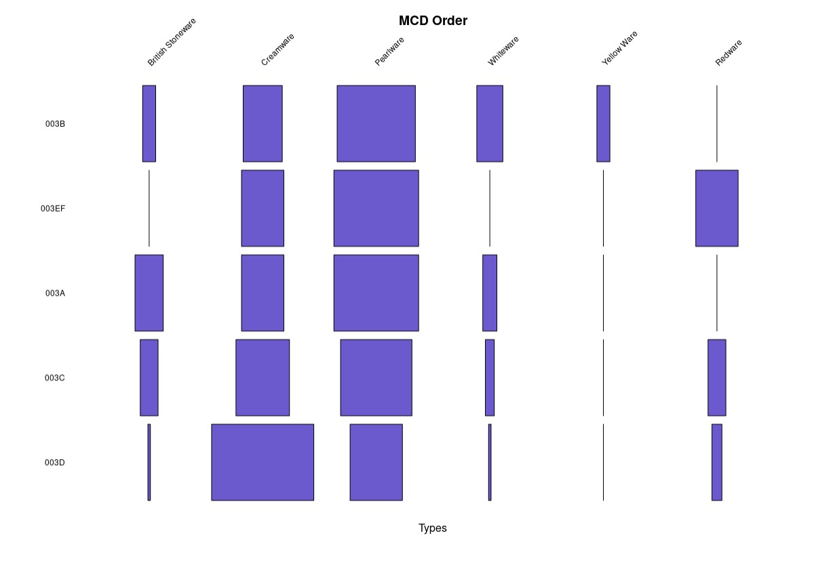

## Part IV: Let's make a Battleship Plot

### Lines 150-229: -- Plot time!

Using the plotrix package and ```battleship.plot()``` function we can create a battleship plot to show the relationship of proportions across the rows and order by MCD




