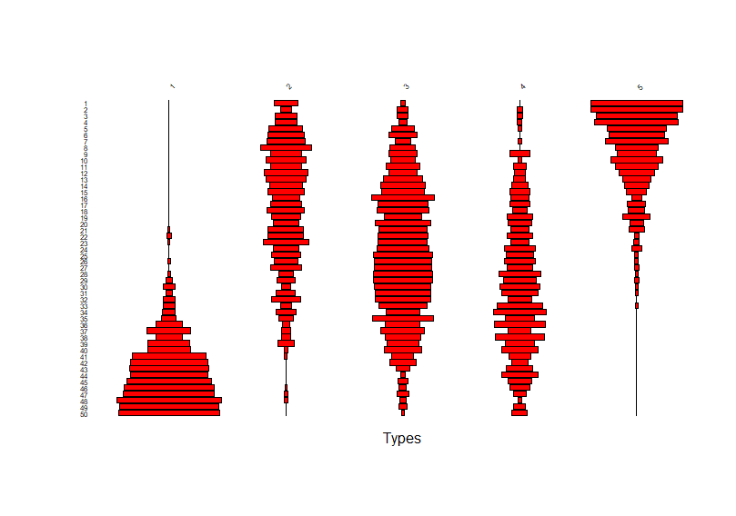

# Welcome to Session 5: Mean Ceramic Dates and TPQs in R

Welcome back! And if you are new, welcome! In this lesson we'll learn how to use R to compute mean ceramic dates (MCDs) and *terminus post quem*s (TPQs). Note to the classical R-chaeologists in the crowd: Yup, that should be *termini post quos* :). We'll also make use of some of the data-wrangling and cleaning skills we learned in previous lessons.  

## Important Links

1. You will need an [RStudio Cloud](https://rstudio.cloud/) account login to continue with today's class. The login is free and quick to create. 
2. Project for today in RStudio Cloud: https://rstudio.cloud/project/3232458
3. Find the recording of this workshop here: https://vimeo.com/user124556947

## The plan and goals for today:

1. Learn how to compute MCDs and a bit about the model of change over time in type frequencies that is (covertly) being invoked when we compute MCDs. And how to check if the model assumptions are met in your data. 
2. Ditto TPQs.
3. Write some R code to compute MCDs for a simple dataset -- ceramic assemblages from a stratified sequence excavated from a 1-meter quadrat in the slave village site at Stewart Castle, Jamaica.
    - Refresh our data-wranging and cleaning skills from last time.
    - Compute MCDs for the stratified assemblages.
    - Compute TPQs too!  
4. And as always, make more plots! Including cool *battleship plots* like this:

### [On to Part I: MCDs and the Model Behind Them ...](https://github.com/DAACS-Research-Consortium/DAACS-Open-Academy/blob/main/FSS2021/Workshop5/Part_I.md)

