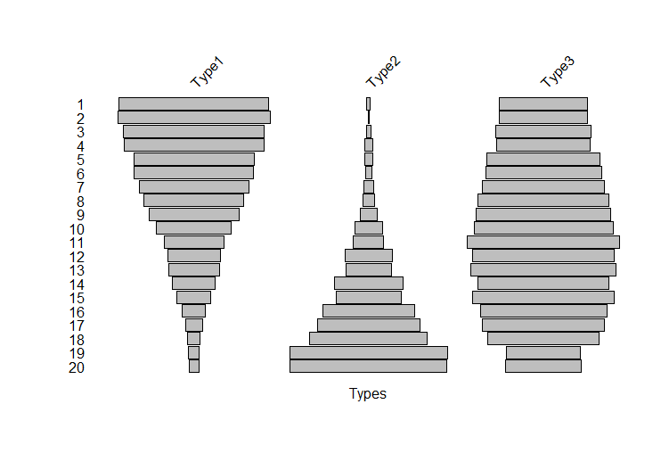
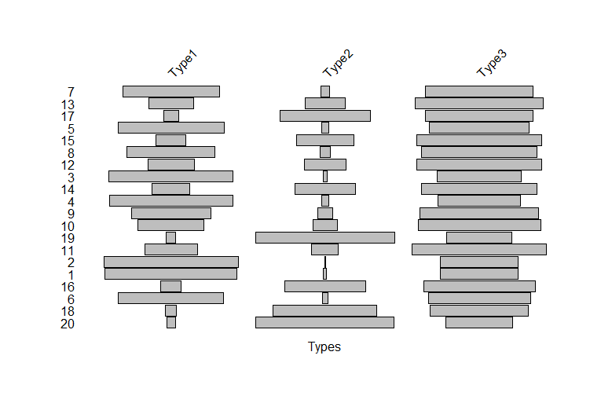
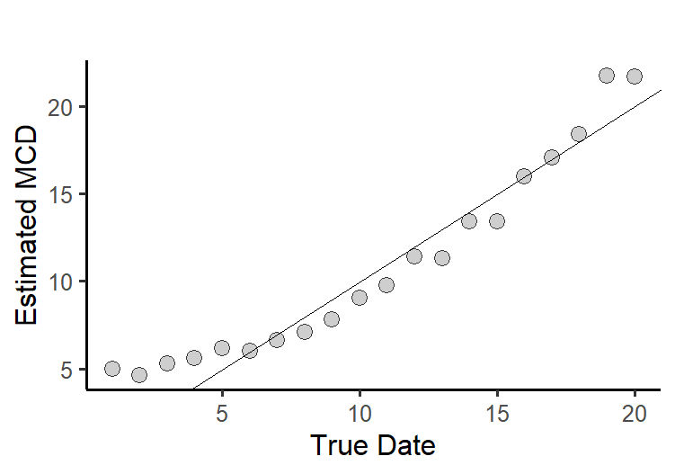

# Part I: Review of MCDs and the Frequnecy Seriation Model  

## 1. Recall how to Compute an MCD
- Think back to Workshop 5...
- An MCD is the weighted average of dates. The dates are estimates of the midpoints of the span of time over which each ceramic type found in an assemblage was manufactured. The weights are frequencies of each type in the assemblage -- more popular types get more weight. 
- Here's the R code from our first example:

``` 
wareMidpoints <- c(1770, 1800, 1820) 
wareCounts1<- c(21, 17, 36) 
mcd <- sum(wareMidpoints*wareCounts1)/sum(wareCounts1)
``` 
## 2. Recall the Frequency Seriation Model
- Over time the relative frequencies of certain artifact types ("historical types") tend to follow a battleship-shaped curves: they start off rare, get popular, then get rare again.
- A geeky way to make this more precise: type frequencies follow Gaussian response functions to time. This implies that the curves are symmetrical.
- Because the curve for each type is symmetrical, the date of the type's peak popularity is both the midpoint and the mean for the curve.

## 3. The Seriation Model is the Foundation for MCDs
- Once again think back to Workshop 5 on MCDs. There we used a simulation to understand why MCDs work (and why they might not). Here's a quick refresher with a diifferent example.
- We ask R to simulate 20 time periods -- you can think of these as years. So start in year *1* and end in year *20*.  
- Then we get R to simulate the popularity curves for three types (Types 1, 2, and 3) for these 20 years. 
- The type frequencies follow symmetrical "battleship-shaped" curves across time. (Geek lingo: the type frequencies follow Gaussian responses).     - So to get a set of three populatity curves, we need to tell R the following:
	- The "years" of maximum popularity -- the "midpoints" -- for the three types are: *m<sub>i</sub>* = [ 2, 29, 9]. These are means of the Gaussian responses. Here the subscript *i* tells us which type we are dealing with: *m<sub>1</sub>* = 2, *m<sub>2</sub>* = 29, *m<sub>3</sub>* = 9.
	- We also need to tell R how spread out in time each popularity curve should be. This models the duration of the type. The spread is set by the (geek lingo) *variance*, which also determines the what we might think of as the beginning and ending dates for the type. *But all we need to worry about here is the type means or midpoints.*          
- When we run the simulation and get the "data" shown below, 
```
Year Type1 Type2 Type3
1    323     8   191
2    360     2   209
3    344    12   234
4    350    20   235
5    293    19   276
6    295    15   286
7    270    24   302
8    226    27   297
9    195    37   292
10   162    58   299
11   114    58   291
12   100    90   270
13    93    84   265
14    66   104   199
15    51    97   211
16    32   128   176
17    24   147   174
18    15   143   136
19    13   196    92
20    11   179    86
```
And here is the battleship plot: 



## 4. Now we pretend we are archaeologsists
- Here is what we see:



## 5. MCDs  
- The MCD method says that we can infer the dates of each assemblage from this mess if we know the type means. 
- All we do is multiply the vector that contains the midpoints of 3 type *m<sub>i</sub>* = [ 2, 29, 9] by the vector of frequencies in each assemblage, add the products, and divide by the sum of the frequencies. We get a weighted average, where the weights are the type relative frequencies. This is the MCD estimate for each assemblage. 
- Then we sort the assemblages on the MCD estimates to see if we see the Gaussian reponses that the model assumes. Here is the plot:


- Hooray!!
- And we can go one step further here. This is a simulation,so we KNOW the true assemblage dates. We can plot MCDs against the true dates (the time periods or "years": 1,2,3,…20) to see how well the method works: 




## 6. MCD Problems
But what if we do not know the means for our types?
	- We don't have the documentary data on manufacturing midpoints.
	- We are unwilling to assume that the manufacturing midpoints apply to the local cultural tradition that generated our assemblages.

CA offers a way forward!

### [On to Part II: Introduction to CA basics -- with a simple seriation example...](https://github.com/DAACS-Research-Consortium/DAACS-Open-Academy/blob/main/FSS2021/Workshop7/Part_II.md)


