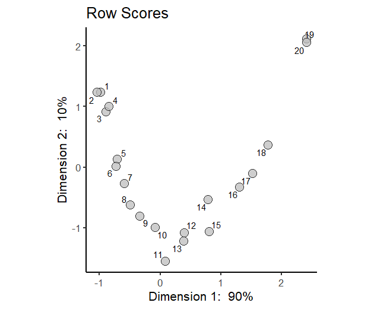
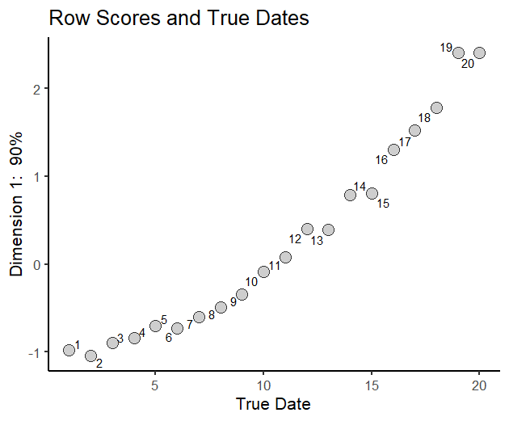

# Part II: Introduction to CA Basics -- With a Simple Seriation Example.

## 1. Some Geometry.
There are several different ways to understand CA and motivate the math behind it. We'll start with geometry. That means pictures!! 
- We will be using the "data" from our simulation of the frequencies of 3 types over 20 years to make our first pictures.
- We can think of the 20 rows of our data matrix (the assemblages) as points in space. The each axis of the space measures the relative frequency of one of the 3 types. So the axes represent the columns of the matrix. Three types gets us three axes. Here they are:
 
- Each axis represents the proportion of its type -- from 0 to 1 -- in an assemblage. So we can plot each assembage on the 3 axes. Here's what that plot looks like:
 
- The points are shaded according to their chronological order.
- Some questions:
  - What are the proportions for the three types in the assemblage represented by the darkest point? 
  - How about the lightest point?
  - How about a point that is medium gray?      
  - Check the *shape* and *orientation* of the point scatter... How would you describe them?
 - Here's another version of the plot, with a "special" triangle added:   
 
- Things to note about the shape: point scatter looks like an arch.
  - Why does this happen ?   
  - This is the hallmark of data that fit the seriation model and we will encounter it in CA.
- Things to note abou the orientation: the points all fall on the surface of the triangle. 
  - Why? Geek answer: the assemblage proportions must obey a "closed sum constraint".
  - So even though we initially plotted the data in 3 dimensions, they actually fall in a 2-d subspace (geek lingo: a simplex).
- The triangle may look familar...   

- Here's another view of the point scatter:

- Note how the points of the triangle represent the locations of (hypothetical) assemblages that have 100% of the corresponding type.
- This means that we can get some idea of the composition of an assemblage by noting what triangle point it is close to. This relationship will carry over to interpreting the results of CA.  
- For 3 types, the assemblage points lie in a 2-d space. With only 2 dimensions, it is pretty easy to guess the chronological order by eyeballing the curved point cloud. 
- But this approach will not work if we have 10 types. Then we are dealing with a 10-1 = 9 dimensional space.
- And even with two dimensions, the geeks in the crowd will insist that we use a reproducible computational method to assign scores to the assemblages such that, when we sort the assemblages on their scores, we get the chronological order. So these scores would serve the same function as MCDs. But they would not be calibrated in "years".
- CA is all about figuring out the assemblage scores. But to do that we also have to figure out a "corresponding" (get it?) set of scores for the types. And just as with MCDs, the assemblage scores in CA are proportional to weighted avarages of the types scores.  

## 2. From Higher-Dimensional Descriptions to Lower Dimensional Summaries
Let's think again about how to describe the job we want to do:
- In our example with 3 types, we have seen that the locations of the assemblage points (and the pattern of distances among them) can be completely described in 2 dimensions.  
- But what the geeks want is to replace that 2-d description with a 1-d summary. The 1-d summary would consist of a single set of scores along a *new* axis. We want a single set of scores such that when we compute the pattern of distances among the points on the new axis, the distances approximate -- as much as possible -- the distances in the orginal 2-d space.  
- In a case with 10 types, the geeks are asking for a 1 or maybe 2-d summary. They might let us get away with a 3-d summary, if it turned out that 3 dimenisons were required for a good summary of the major trends in the data.
- So in all cases, we want to go from a completely accurate higher-dimensional description, to a less accurate low-dimensional summary.
- But some low-dimensional summaries are better than others!! 
- To pick the best one, we need a way to measure how much variation there is in the original data. We can then compare it to how much variation is captured in the summary. We want a low-dimensional summary that captures the highest possible amount of the variation in the original data

## 3. Measuring Distances and Variation
- Here's another picture. It will help us think about how to measure the total amount of variation in the orginal data.

- The red dot is the *mean* of the type proportions(geek lingo: "centroid"). We compute it by adding up counts for each of the types and dividing by the sum of the counts in all the assemblages. Here is the vector, straight from the R console: 
```
    Type1     Type2     Type3 
0.3585859 0.1555985 0.4858156 
```
- Here's how  we are going to compute our measure of total variation (geek lingo: *inertia*):
1. Compute the mean of the type proportions (the red dot). We did that! But here is the code:
```
> # the compute the mean proportions for the three types
> colProps<- colSums(simData)/ sum(simData)
> colProps
    Type1     Type2     Type3 
0.3585859 0.1555985 0.4858156 
```
2. Compute the squared distance from each assemblage to the red dot. The distance we use to do this in CA is called (more geek lingo) the *chi-square distance*. Here is the computation for the first row of the matrix of type proportions. First, we check the proportions for the first assemblage:
```
  propMat[1,]
     Type1      Type2      Type3 
0.61877395 0.01532567 0.36590038 
```
Now we get the sum of squared differences between the mean proportions (the centroid) and the proportions in the first assemblage: 
```
> (propMat[1,] - colProps)^2
     Type1      Type2      Type3 
0.06769784 0.01967648 0.01437966
```
To get the *squared chi-square distance* we square the differences, divide by the mean proportions, and add the terms up.
```
> squaredChi2DistFromMean <- sum((propMat[1,] - colProps)^2/colProps)
> squaredChi2DistFromMean
[1] 0.3448469
```
If we had skipped the division step, we would have a *squared Euclidean distance*. It's dividing by the column means (centroid) that makes it a *chi-squared distance*. Think back to intro stats.... The guts of the chi-squared statistic is *(O-E)<sup>2</sup>/E*, where *O* is a *observed* count and *E* is an *expected* count. See the parallel?

The division step weights the final distance inversely in proportion to the overall frequency of each type. So rare types contribute more!

Now we compute the squared chi-squared distances to the mean (centroid) for all the other assemblages. Check the code file for how to do this. 

 3. Here is the last step in getting our measure of variation in the data:  We compute a weighted sum of the square chi-squared distances, where the weights are the sizes of the assemblages: bigger asssemblages get more weight. This weighted sum is the *inertia* value we need. Here is the code:
 ```
> rowProps <- rowSums(simData)/ sum(simData) 
> inertia <- sum(squaredChi2DistsFromMean * rowProps)
> inertia
[1] 0.3383227
```
So *inertia = sum( i'th row proportion x squared chi-squared distance from the i'th row to the the centroid)*

where the *row proportion* is the sum of the row counts, divided by the total count in the entire dataset. In other words, it's the proportion of the total dataset comprised by that assemblage. 

## 4. Computing CA
Chi-squared distance and inertia are the basic concepts that we need to begin to interpret CA results. We will be using the ca() function in the *ca* R package, which was written by Micheal Greenacre (see README for his wonderful book on CA). We don't have time to cover how the CA results are actually computed. The guts of computational methods are from linear algebra. There are two related techniques. One is called *singular value decomposition*. It's used by the *ca* package and described in Greenacre's book. A related technque is called *eigenanalysis*. They produce the same results. These are the same techniques that are used to do *principal component analysis*. In fact, CA may be regarded as a version of PCA, especially tailored to count data (vs. measurements).     

## 5. Doing a CA of our Simulated Data 
For our first time out with CA, let's analyze the simulated data with three types and 20 assemblages. Here is the code:
```
> ca1 <- ca(simData)
```
Let's check what's in the *ca1* object 
```
> str(ca1)
List of 16
 $ sv        : num [1:2] 0.552 0.184
 $ nd        : logi NA
 $ rownames  : chr [1:20] "1" "2" "3" "4" ...
 $ rowmass   : num [1:20] 0.0561 0.0614 0.0634 0.065 0.0632 ...
 $ rowdist   : num [1:20] 0.587 0.62 0.524 0.501 0.391 ...
 $ rowinertia: num [1:20] 0.01934 0.02358 0.0174 0.01631 0.00965 ...
 $ rowcoord  : num [1:20, 1:2] -0.98 -1.045 -0.899 -0.844 -0.707 ...
  ..- attr(*, "dimnames")=List of 2
  .. ..$ : chr [1:20] "1" "2" "3" "4" ...
  .. ..$ : chr [1:2] "Dim1" "Dim2"
 $ rowsup    : logi(0) 
 $ colnames  : chr [1:3] "Type1" "Type2" "Type3"
 $ colmass   : num [1:3] 0.359 0.156 0.486
 $ coldist   : num [1:3] 0.547 1.171 0.189
 $ colinertia: num [1:3] 0.1074 0.2135 0.0174
 $ colcoord  : num [1:3, 1:2] -0.9399 2.0951 0.0227 0.9515 1.0186 ...
  ..- attr(*, "dimnames")=List of 2
  .. ..$ : chr [1:3] "Type1" "Type2" "Type3"
  .. ..$ : chr [1:2] "Dim1" "Dim2"
 $ colsup    : logi(0) 
 $ N         : int [1:20, 1:3] 323 360 344 350 293 295 270 226 195 162 ...
 $ call      : language ca.matrix(obj = as.matrix(obj))
 - attr(*, "class")= chr "ca"
```
It turns out the function call *ca()* produces a *list*. You can get a description of what's in the list by doing:
```
?ca
```
We are going to focus on just three objects: 
- The *singular values*. These are the square roots of the inertia values for each new CA dimension.
```
> ca1$sv
[1] 0.5519299 0.1835650
```
  - There are 2 singular values, one for each new axis or dimension computed by CA. There are only 2 in this case because our simulated data have three types (columns). But the closed-sum constaint means that all the *inertia* can the described in 2 dimensions. More generally, there will *number of columns-1* or *number of rows-1* singular values and corresponding new dimensions or axes in a CA, whichever is less.
  - The squares of the *singular values* are called the *eigenvalues*. They measure the amount on inertia that is described by each new dimension.
```
> ca1$sv^2
[1] 0.3046266 0.0336961
> sum(ca1$sv^2)[1] 0.3383227
```
  - Hmm... where have we seen that number before?
  - The inertia values decline across the CA dimensions. The first dimension or axis is placed through point scatter so that it the accounts for the most possible inertia. The second dimension is placed so it accounts for the most possible inertia, with the constraint that the scores on it are uncorrelated with the scores on the first dimension. If there is a third dimension, it is placed so that accounts for the the most inertia, with the constraint that it is uncorrelated with the previous dimensions, and so forth for higher dimensions. 
  - When judging the results of a CA, what matters is not the absolute values of the inertia associated with each new CA dimension, but the percentage inertia, relative to the total inertia.  So we want to say something like "the first CA dimension accounted for *x* % of the total inertia in the data". Here is the computation: 
> ca1$sv^2/sum(ca1$sv^2)
[1] 0.9004025 0.0995975
  - Wow! The first CA dimension or axis accounts for 90% of the inertia in the data. That means that we can see nearly all of the inertia in the orginail (2-d) data by just looking at the scores of the assemblages *one dimension*.
  - Here is the code to do a plot of the proportion of inertia:
 ``` 
 # put the result in a data frames for ggplot
inertia <- data.frame('Prop.Inertia' = prop.table(ca1$sv^2))
# plot the proportion of inertia
theme_set(theme_classic(base_size = 16))
ggplot(data=inertia , aes(x= 1:length(Prop.Inertia), y=Prop.Inertia)) +
  scale_x_continuous(breaks= 1:length(inertia$Prop.Inertia)) +
  geom_bar(stat="identity", fill="grey") +
  labs( title="",
        x="Dimension", y='Proportion of Inertia')
```
  - And here is the plot. It's called a *scree plot*.
 
  
 - The *row coordinates*. These are the scores of the assemblages on the new CA dimensions.
  
 - Let's see how well the score on CA Dimension 1 fit the "true dates" from the simulation.
   
- And finally let's check the *column coordinates*. These are scores of the types on the new CA dimensions.
   


 


  


