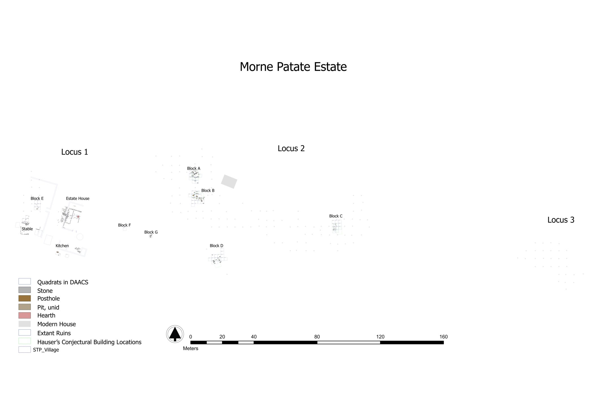

# Part III: CA of some real-world data: ceramic assemblages from Morne Patate, Dominica
We are going to be working with data from Morne Patate, a sugar plantation in Dominica occupied in the 18th and 19th centuries. The occupation extends across the transition from French to English control of the island in 1763 and emancipation of the enslaved labor force in 1834. An archaeological chronology is essential if we hope to learn about the effects of these events on plantation organization and the lives of its enslaved and free residents. What we will do today is a simplified verion of the analysis reported in:
- Lynsey A., Jillian E. Galle, and Fraser D. Neiman 2020. "Building an Archaeological Chronologyfor Morne Patate". In *Archaeology in Dominica: Everyday Ecologies and Economies at Morne Patate*, edited by Mark W. Hauser and Diane Wallman. University of Florida Press, Gainsville(2020), pp. 64-87. 

- Code, data and a preprint of the article are availbale here: https://osf.io/52jfn/
- Complete data from Morne Patate are available on the DAACS website: https://www.daacs.org/plantations/morne-patate-estate/ 
- Here is a schematic site plan (click for more detail): 
 
